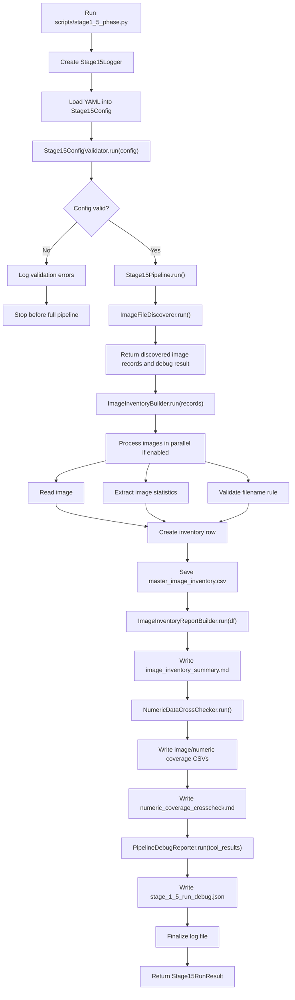

# Stage 1.5 Image Inventory and Pipeline Readiness Plan

Stage 1.5 prepares the raw image dataset for later EDA, preprocessing validation, and model development. It is not a labeling stage and it is not the full Stage 2 EDA. Its purpose is to create a technical source of truth for image files, verify image integrity, record image-property baselines, and make the process reproducible.

Raw images must remain unchanged. Stage 1.5 only reads raw files and writes derived CSV, report, debug, and log artifacts.

## Objectives

- Verify that raw image files can be discovered and opened safely.
- Create one master image inventory CSV with technical image properties.
- Detect unreadable images and record errors without stopping the full run.
- Measure raw image properties before preprocessing, including dimensions, channels, file size, RGB ranges, and brightness.
- Validate filename rules from config instead of hard-coding naming assumptions.
- Produce a quick image-property summary report for review.
- Cross-check available numeric CSV files against the master image inventory.
- Produce a structured debug report and chronological log file for each full run.
- Keep the stage modular, testable, and runnable through one phase script.

## Non-Objectives

- Do not manually categorize fruit types when folder or filename context already indicates the dataset.
- Do not create daily, fruit-specific, or stage-specific CSV files as primary outputs.
- Do not assign biological labels, RUL values, EOL anchors, or fruit quality classes.
- Do not move, rename, delete, overwrite, or preprocess raw images.
- Do not perform full Stage 2 EDA, temporal decay analysis, labeling analysis, or model-ready split generation.

## Proposed Folder Structure

```text
configs/
  stage_1_5_image_inventory.yaml
  stage_1_5_image_inventory_full.yaml
  stage_1_5_dev_sample.json

src/
  stage1_5_image_inventory/
    __init__.py
    base.py
    config.py
    config_validator.py
    logging_utils.py
    file_discovery.py
    image_reader.py
    image_statistics.py
    naming_rules.py
    inventory_builder.py
    report_builder.py
    numeric_crosscheck.py
    debug_reporter.py
    dev_sample_builder.py
    pipeline.py

scripts/
  stage1_5_phase.py
  build_stage1_5_dev_sample.py

data/
  01_raw_dev_sample/
    avocado_n100_seed20260629/
      sample_manifest.csv
  02_processed/
    stage_1_5/
      sample/
        master_image_inventory.csv
      full/
        master_image_inventory.csv
        image_numeric_coverage.csv
        numeric_image_coverage.csv

output/
  graphs/
    stage_1_5/
      sample/
      full/
  reports/
    stage_1_5/
      sample/
        image_inventory_summary.md
        stage_1_5_run_debug.json
      full/
        image_inventory_summary.md
        numeric_coverage_crosscheck.md
        stage_1_5_run_debug.json

logs/
  stage_1_5/
    STAGE_1_5_PROGRESS_JOURNAL.md
    YYYY_MM_DD/
      HH_MM_SS.txt
```

The `scripts/stage1_5_phase.py` file should stay thin. It should parse command-line arguments, load the config, validate it, create the pipeline, and run the phase.

The Stage 1.5 progress journal should live under `logs/stage_1_5/STAGE_1_5_PROGRESS_JOURNAL.md`. The journal is an internal progress and handoff record for Stage 1.5 contributors and future agents. The complete reviewed specification should remain in this docs file.

The development sample builder is separate from the Stage 1.5 pipeline. It exists only to create a reproducible small dataset for testing tools and integrated programs without running on the full raw dataset.

## Main Run Command

```bash
python scripts/stage1_5_phase.py --config configs/stage_1_5_image_inventory.yaml
```

The default config should point to the 100-image development sample while tools are being built and tested. Use `configs/stage_1_5_image_inventory_full.yaml` only when the team is ready for a reviewed full-dataset run.

## Development Sample Tool

Development and testing should not use the full raw dataset by default. Use the standalone sample builder to create a reproducible 100-image dataset that preserves the source directory structure.

This tool is outside the main Stage 1.5 flow:

```bash
python scripts/build_stage1_5_dev_sample.py --config configs/stage_1_5_dev_sample.json
```

Default behavior:

- Read image candidates from the configured full dataset root, initially `data/01_raw/avocado`.
- Select 100 images using a preserved random seed.
- Copy selected images into a separate sample root.
- Preserve relative directory structure under the sample root.
- Write a manifest with source and destination paths.
- Leave the full raw dataset unchanged.

Default output:

```text
data/01_raw_dev_sample/avocado_n100_seed20260629/
  avocado/
    ...
  sample_manifest.csv
```

Tools under development can switch between the full dataset and the sample dataset by changing their configured raw root. For example, the Stage 1.5 inventory config can point to `data/01_raw_dev_sample/avocado_n100_seed20260629/avocado` while developing, then switch back to `data/01_raw/avocado` for the reviewed full run.

The sample builder uses a JSON config because PyYAML is not currently listed in the project requirements. This keeps the utility runnable without adding a new dependency during the scaffold/checkpoint phase.

## Class Design

```mermaid
classDiagram
    class Stage15Tool {
        <<abstract>>
        +str tool_name
        +run(...) ToolRunResult
    }

    class ToolRunResult {
        +str tool_name
        +bool success
        +str started_at
        +str finished_at
        +float duration_seconds
        +str message
        +Any data
        +list warnings
        +list errors
        +dict debug
    }

    class Stage15Logger {
        +Path log_path
        +info(message) None
        +warning(message) None
        +error(message) None
        +close() None
    }

    class Stage15Config {
        +Path project_root
        +list raw_roots
        +list image_extensions
        +dict naming_rules
        +str active_naming_rule
        +dict processing
        +dict output
        +dict logging
        +from_yaml(config_path) Stage15Config
        +resolve_path(path_value) Path
    }

    class Stage15ConfigValidator {
        +run(config) ToolRunResult
    }

    class ImageFileDiscoverer {
        +run() ToolRunResult
        -is_supported_extension(path) bool
        -build_file_record(path) ImageFileRecord
    }

    class ImageReader {
        +read(path) ImageReadResult
    }

    class ImageStatisticsExtractor {
        +extract(path, image) ImageStats
    }

    class FilenameRuleParser {
        +parse(filename) FilenameParseResult
    }

    class ImageInventoryBuilder {
        +run(records) ToolRunResult
        -process_one(record) ImageInventoryRow
    }

    class ImageInventoryReportBuilder {
        +run(inventory_df) ToolRunResult
    }

    class PipelineDebugReporter {
        +run(tool_results) ToolRunResult
    }

    class NumericDataCrossChecker {
        +run() ToolRunResult
        -build_image_index(inventory_rows) dict
        -build_image_coverage_rows(...) list
        -build_numeric_coverage_rows(...) list
    }

    class Stage15Pipeline {
        +run() Stage15RunResult
    }

    Stage15ConfigValidator --|> Stage15Tool
    ImageFileDiscoverer --|> Stage15Tool
    ImageInventoryBuilder --|> Stage15Tool
    ImageInventoryReportBuilder --|> Stage15Tool
    NumericDataCrossChecker --|> Stage15Tool
    PipelineDebugReporter --|> Stage15Tool

    Stage15Pipeline --> Stage15Config
    Stage15Pipeline --> Stage15Logger
    Stage15Pipeline --> ImageFileDiscoverer
    Stage15Pipeline --> ImageInventoryBuilder
    Stage15Pipeline --> ImageInventoryReportBuilder
    Stage15Pipeline --> NumericDataCrossChecker
    Stage15Pipeline --> PipelineDebugReporter

    ImageInventoryBuilder --> ImageReader
    ImageInventoryBuilder --> ImageStatisticsExtractor
    ImageInventoryBuilder --> FilenameRuleParser
```



## Execution Flow



## Module Responsibilities

| Module | Main Class | Responsibility |
| --- | --- | --- |
| `base.py` | `Stage15Tool`, `ToolRunResult` | Shared run contract for every tool-like stage component. |
| `config.py` | `Stage15Config` | Load config values and resolve project-relative paths. |
| `config_validator.py` | `Stage15ConfigValidator` | Validate paths, extensions, naming rules, outputs, and processing settings before full execution. |
| `logging_utils.py` | `Stage15Logger` | Create a timestamped human-readable log file and record run events. |
| `file_discovery.py` | `ImageFileDiscoverer` | Scan configured raw roots and build file records for supported image files. |
| `image_reader.py` | `ImageReader` | Open images safely and capture readability errors. |
| `image_statistics.py` | `ImageStatisticsExtractor` | Compute dimensions, channels, RGB statistics, brightness statistics, file hash, and timestamps. |
| `naming_rules.py` | `FilenameRuleParser` | Validate filenames using the active config rule and return parsed fields when available. |
| `inventory_builder.py` | `ImageInventoryBuilder` | Combine file metadata, read results, image statistics, and naming results into the master CSV table. |
| `report_builder.py` | `ImageInventoryReportBuilder` | Build the quick image-property summary report from the master inventory. |
| `numeric_crosscheck.py` | `NumericDataCrossChecker` | Cross-check master inventory image timestamps/dates against hardness and environmental numeric CSVs. |
| `debug_reporter.py` | `PipelineDebugReporter` | Write structured JSON describing tool results, warnings, errors, paths, counts, and duration. |
| `pipeline.py` | `Stage15Pipeline` | Orchestrate the validated full Stage 1.5 workflow. |

## ToolRunResult Contract

Every major executable class should return a `ToolRunResult`. The pipeline should collect these results and pass them to the debug reporter.

Minimum fields:

| Field | Purpose |
| --- | --- |
| `tool_name` | Identifies which module produced the result. |
| `success` | Indicates whether this module completed successfully. |
| `started_at` | Start timestamp. |
| `finished_at` | Finish timestamp. |
| `duration_seconds` | Runtime duration for this module. |
| `message` | Short human-readable status message. |
| `data` | Main returned object, such as config, records, DataFrame, or output path. |
| `warnings` | Non-fatal problems discovered by the module. |
| `errors` | Fatal or important errors discovered by the module. |
| `debug` | Structured metadata useful for the debug JSON report. |

The main script should validate config before running the full pipeline. If config validation fails, the process should log the errors and stop before image discovery.

## Configurable Parameters

The initial config file should be stored at:

```text
configs/stage_1_5_image_inventory.yaml
```

Planned parameters:

| Parameter | Type | Purpose |
| --- | --- | --- |
| `project_root` | path | Base path used to resolve project-relative inputs and outputs. |
| `raw_roots` | list[path] | Folders to scan for raw image files, such as `data/01_raw/avocado`. |
| `image_extensions` | list[str] | Accepted image extensions, such as `.jpg`, `.jpeg`, `.png`. |
| `output.inventory_csv_path` | path | Output path for the master image inventory CSV. |
| `output.summary_report_path` | path | Output path for the Markdown image-property summary report. |
| `output.debug_report_path` | path | Output path for the structured JSON run debug report. |
| `output.graphs_dir` | path | Output directory for generated image-property charts. |
| `logging.logs_root` | path | Root folder for timestamped log files. |
| `logging.level` | str | Logging threshold, initially expected to be `INFO`. |
| `logging.write_per_image_warnings` | bool | Whether image-level warnings are written to the human-readable log. |
| `processing.parallel` | bool | Whether per-image processing runs concurrently. |
| `processing.max_workers` | int | Maximum number of worker threads for per-image processing. |
| `processing.fail_fast` | bool | Whether the run stops on the first image-level failure. Expected default is `false`. |
| `processing.sort_output_by` | str | Column used for deterministic CSV ordering, expected default is `relative_path`. |
| `naming_rules.active_rule` | str | Name of the filename rule used during validation. |
| `naming_rules.rules.<rule_name>.regex` | str | Regex used to parse or validate filename stems. |
| `naming_rules.rules.<rule_name>.description` | str | Human-readable explanation of the rule. |
| `naming_rules.rules.<rule_name>.required_fields` | list[str] | Parsed fields expected from the regex. |
| `naming_rules.rules.<rule_name>.optional_fields` | list[str] | Parsed fields allowed but not required. |
| `naming_rules.rules.<rule_name>.date_fields` | dict | Optional mapping of parsed date fields to date formats. |
| `numeric_crosscheck.enabled` | bool | Whether to run the final coverage layer after the master inventory and image-property report. |
| `numeric_crosscheck.output.image_coverage_csv_path` | path | Output CSV with one row per inventory image and flags for numeric coverage. |
| `numeric_crosscheck.output.numeric_coverage_csv_path` | path | Output CSV with one row per numeric record key and flags for matching images. |
| `numeric_crosscheck.output.report_path` | path | Markdown report summarizing numeric/image coverage. |
| `numeric_crosscheck.hardness.csv_path` | path | Hardness CSV path, currently `data/01_raw/avocado/hardness/hardness.csv`. |
| `numeric_crosscheck.hardness.date_column` | str | Hardness date column, currently `time`. |
| `numeric_crosscheck.hardness.fruit_value_prefix` | str | Prefix used to identify fruit hardness columns, currently `fruit_`. |
| `numeric_crosscheck.environment.csv_path` | path | Environmental values CSV path, currently `data/01_raw/avocado/th10s_readings.csv`. |
| `numeric_crosscheck.environment.timestamp_column` | str | Environmental timestamp column, currently `timestamp`. |
| `numeric_crosscheck.image_timestamp.regex` | str | Regex used to parse date/time from image filenames for numeric matching. |
| `numeric_crosscheck.image_timestamp.timezone_policy` | str | Current policy is `compare_local_timestamp_text`, matching the webcam filename time text against the environment timestamp local time text. |

Example starter config:

```yaml
project_root: .

raw_roots:
  - data/01_raw_dev_sample/avocado_n100_seed20260629/avocado

image_extensions:
  - .jpg
  - .jpeg
  - .png

output:
  inventory_csv_path: data/02_processed/stage_1_5/sample/master_image_inventory.csv
  summary_report_path: output/reports/stage_1_5/sample/image_inventory_summary.md
  debug_report_path: output/reports/stage_1_5/sample/stage_1_5_run_debug.json
  graphs_dir: output/graphs/stage_1_5/sample

logging:
  logs_root: logs/stage_1_5
  level: INFO
  write_per_image_warnings: true

processing:
  parallel: true
  max_workers: 8
  fail_fast: false
  sort_output_by: relative_path

naming_rules:
  active_rule: fallback_stem_only
  rules:
    fallback_stem_only:
      description: "Fallback rule that accepts any filename stem as sample_id."
      regex: "^(?P<sample_id>.+)$"
      required_fields:
        - sample_id
      optional_fields: []
      date_fields: {}

numeric_crosscheck:
  enabled: true
  output:
    image_coverage_csv_path: data/02_processed/stage_1_5/sample/image_numeric_coverage.csv
    numeric_coverage_csv_path: data/02_processed/stage_1_5/sample/numeric_image_coverage.csv
    report_path: output/reports/stage_1_5/sample/numeric_coverage_crosscheck.md
  hardness:
    csv_path: data/01_raw/avocado/hardness/hardness.csv
    date_column: time
    fruit_value_prefix: fruit_
  environment:
    csv_path: data/01_raw/avocado/th10s_readings.csv
    timestamp_column: timestamp
  image_timestamp:
    regex: "^webcam_(?P<date>\\d{4}-\\d{2}-\\d{2})_(?P<time>\\d{2}-\\d{2}-\\d{2})(?:\\.[^.]+)?$"
    timezone_policy: compare_local_timestamp_text
```

The first implementation should start with a permissive fallback rule. After inspecting actual filenames, the team can update the config with stricter filename rules.
The numeric cross-check uses a stricter timestamp regex because it needs to compare images with available numeric rows. Hardness is currently validated at date level because the hardness CSV has daily fruit columns, not image-localized fruit IDs.

Full-dataset runs should use:

```text
configs/stage_1_5_image_inventory_full.yaml
```

Development and testing runs should use:

```text
configs/stage_1_5_image_inventory.yaml
```

Development sample config:

```text
configs/stage_1_5_dev_sample.json
```

| Parameter | Type | Purpose |
| --- | --- | --- |
| `project_root` | path | Base path used to resolve project-relative source and output paths. |
| `source_roots` | list[path] | Full dataset folders to sample from. |
| `output_root` | path | Separate root where the sampled dataset is copied. |
| `manifest_path` | path | CSV file recording selected source and destination paths. |
| `image_extensions` | list[str] | Accepted image extensions for sampling. |
| `sample_size` | int | Number of images to sample, expected default is `100`. |
| `random_seed` | int | Seed used for deterministic sampling. |
| `include_source_root_name` | bool | Whether to include the source root folder name, such as `avocado`, under the output root. |
| `copy_mode` | str | Materialization method. Currently only `copy` is supported. |
| `overwrite_existing` | bool | Whether existing sampled files can be overwritten. Expected default is `false`. |

## Master CSV Schema

The master CSV should contain one row per discovered image file.

Planned columns:

```text
image_id
relative_path
parent_folder
filename
file_stem
extension
file_size_bytes
created_time
modified_time
is_readable
read_error
width
height
channels
color_mode
mean_r
mean_g
mean_b
std_r
std_g
std_b
min_r
min_g
min_b
max_r
max_g
max_b
brightness_mean
brightness_std
image_hash
naming_rule_matched
parsed_sample_id
```

Additional `parsed_*` columns may be added only when the active naming rule defines those fields. The CSV should not include redundant semantic fields such as `fruit`, `stage`, `label`, `duplicate_group`, or manual `notes`.

## Image Property Summary Report

The Markdown report should summarize image-level technical properties only.

Minimum sections:

- Run overview.
- Total discovered image files.
- Readable and unreadable image counts.
- Extension counts.
- Width and height summary.
- File size summary.
- Channel and color mode summary.
- RGB min, max, mean, and standard deviation summary.
- Brightness mean and standard deviation summary.
- Naming rule match and failure counts.
- Obvious outlier counts.
- Image-property charts stored under `output.graphs_dir`.
- Recommended review actions before Stage 2 EDA or Stage 3 preprocessing work.

Minimum charts:

- Image count by extension.
- Readable image dimensions.
- File size distribution.
- Brightness mean distribution.
- RGB mean boxplot.

## Debug Report

The debug report should be structured JSON and should be useful for programmatic inspection.

Minimum content:

- Config path.
- Log path.
- Output paths.
- Tool run results.
- Raw roots checked.
- Extensions accepted.
- Discovered file count.
- Readable image count.
- Unreadable image count.
- Naming rule match count.
- Naming rule failure count.
- Warning count.
- Error count.
- Runtime duration.
- Failed image paths and error messages.

## Log File

Each full run should write one chronological log file:

```text
logs/stage_1_5/YYYY_MM_DD/HH_MM_SS.txt
```

If two runs start within the same second, the logger may append a numeric suffix, such as `HH_MM_SS_001.txt`, to avoid overwriting an existing log.

The log should contain:

- Run start and finish.
- Config path used.
- Config validation result.
- Raw roots scanned.
- Number of files discovered.
- Extensions found.
- Parallel processing settings.
- Image-level warnings and errors when enabled.
- Master CSV output path.
- Summary report output path.
- Debug JSON output path.
- Final status and duration.

Successful images do not need one log line each. For large runs, log per-image details only for warnings and errors.

The broad progress journal is separate from per-run logs:

```text
logs/stage_1_5/STAGE_1_5_PROGRESS_JOURNAL.md
```

Use the journal to track checkpoint status and handoff notes. Use timestamped log files to track a specific pipeline execution.

## Parallel Processing Plan

Per-image work should be parallelized inside `ImageInventoryBuilder`.

Recommended initial implementation:

```text
concurrent.futures.ThreadPoolExecutor
```

Reasoning:

- Image reads and hash computation are file I/O heavy.
- Threading is simpler and safer than multiprocessing on Windows.
- The implementation can still be switched to multiprocessing later if color statistics become CPU-bound.

Expected behavior:

- One worker processes one image record at a time.
- Each worker reads the image, extracts statistics if readable, validates the filename, and returns one inventory row.
- Image-level failures are captured in the row and in debug information.
- The full run continues when `processing.fail_fast` is `false`.
- Final rows are sorted deterministically before writing the CSV.

## Review Checkpoints

Use these checkpoints during implementation review. Do not move to the next checkpoint until the current one is accepted.

| Checkpoint | Scope | Review Evidence | Status |
| --- | --- | --- | --- |
| 1 | Confirm Stage 1.5 plan and config parameters | This document | Done |
| 2 | Add folder structure and skeleton classes | Created files under `src/stage1_5_image_inventory/` and `scripts/` | Done |
| 2.5 | Add standalone deterministic dev sample builder | 100-image sample folder and `sample_manifest.csv` | Done |
| 3 | Implement config loading, validation, and logging | Config validation output and timestamped log file | Done |
| 4 | Implement file discovery | Discovery result with counts by extension and raw root | Done |
| 5 | Implement image reading and statistics | Small sample run with readable and unreadable handling | Done |
| 6 | Implement naming rule validation | Filename match/failure counts from config rule | Done |
| 7 | Implement master CSV generation | `data/02_processed/stage_1_5/master_image_inventory.csv` | Done |
| 8 | Implement summary and debug reports | Markdown summary and JSON debug report | Done |
| 9 | Run full Stage 1.5 on current data | CSV, report, debug JSON, and log from one complete run | Done |
| 9.5 | Implement final numeric coverage cross-check | Image coverage CSV, numeric coverage CSV, and numeric coverage report | Done |
| 10 | Review outputs and refine rules | Team-approved changes to config or schema | Review |

## Pre-Full-Run Expected Results

Status as of June 30, 2026: the sample pipeline is complete and accepted through Checkpoint 8. The full-dataset run has not been executed yet.

Expected full run command:

```bash
python scripts/stage1_5_phase.py --config configs/stage_1_5_image_inventory_full.yaml
```

Current full config target:

```text
data/01_raw/avocado
```

Read-only pre-check of that root found:

| Item | Expected Value |
| --- | ---: |
| Supported image files | 1027 |
| `.jpg` files | 1027 |
| `.jpeg` files | 0 |
| `.png` files | 0 |

Based on the 100-image sample run, the expected full-run outcome is:

| Output Metric | Expected Result |
| --- | --- |
| Master CSV rows | About 1027, one row per supported image |
| Readable files | Expected to be close to 1027 |
| Unreadable files | Expected to be 0 if the sample is representative |
| Naming rule matches | Expected to be 1027 using `fallback_stem_only` |
| Naming rule failures | Expected to be 0 using `fallback_stem_only` |
| Main extension | `.jpg` |
| Dominant dimensions | Expected to remain `1920x1080` |
| Dominant color mode | Expected to remain `RGB` |
| Dominant channels | Expected to remain `3` |

Sample-based numeric reference:

| Metric | Sample Result |
| --- | ---: |
| Sample rows | 100 |
| File size mean bytes | 179094.3100 |
| Brightness mean | 137.1663 |
| Brightness mean min | 132.2966 |
| Brightness mean max | 142.9711 |

Resolved output decision before full execution:

- The development sample config now writes under `sample/` output folders.
- The full config now writes under `full/` output folders.
- This prevents the full run from overwriting sample CSV/report/debug/chart evidence.

## Full-Run Actual Results

Status as of June 30, 2026: the full avocado Stage 1.5 run completed successfully with separated `full/` outputs.

Run command:

```bash
python scripts/stage1_5_phase.py --config configs/stage_1_5_image_inventory_full.yaml
```

Main outputs:

| Artifact | Path |
| --- | --- |
| Master CSV | `data/02_processed/stage_1_5/full/master_image_inventory.csv` |
| Summary report | `output/reports/stage_1_5/full/image_inventory_summary.md` |
| Image/numeric coverage CSV | `data/02_processed/stage_1_5/full/image_numeric_coverage.csv` |
| Numeric/image coverage CSV | `data/02_processed/stage_1_5/full/numeric_image_coverage.csv` |
| Numeric coverage report | `output/reports/stage_1_5/full/numeric_coverage_crosscheck.md` |
| Debug report | `output/reports/stage_1_5/full/stage_1_5_run_debug.json` |
| Latest run log | `logs/stage_1_5/2026_06_30/16_25_27.txt` |
| Graphs directory | `output/graphs/stage_1_5/full/` |

Full-run counts:

| Metric | Result |
| --- | ---: |
| Inventory rows | 1027 |
| Readable images | 1027 |
| Unreadable images | 0 |
| Naming rule matches | 1027 |
| Naming rule failures | 0 |
| `.jpg` files | 1027 |
| `1920x1080` images | 1027 |
| `RGB` images | 1027 |
| 3-channel images | 1027 |

Full-run numeric summary:

| Metric | Min | Max | Mean |
| --- | ---: | ---: | ---: |
| `file_size_bytes` | 122198.0000 | 204735.0000 | 179617.3768 |
| `brightness_mean` | 130.0637 | 143.0585 | 136.6308 |
| `mean_r` | 134.9481 | 146.6052 | 140.2604 |
| `mean_g` | 127.7684 | 142.4133 | 135.3634 |
| `mean_b` | 128.9690 | 140.1997 | 133.6375 |

Generated charts:

- `output/graphs/stage_1_5/full/extension_counts.png`
- `output/graphs/stage_1_5/full/dimension_counts.png`
- `output/graphs/stage_1_5/full/file_size_distribution.png`
- `output/graphs/stage_1_5/full/brightness_mean_distribution.png`
- `output/graphs/stage_1_5/full/rgb_mean_boxplot.png`

Final numeric coverage cross-check:

| Metric | Result |
| --- | ---: |
| Inventory images checked | 1027 |
| Images with parsed timestamp | 1026 |
| Images without parsed timestamp | 1 |
| Images with hardness date record | 1026 |
| Images missing hardness date record | 1 |
| Images with environment timestamp record | 1026 |
| Images missing environment timestamp record | 1 |
| Numeric rows checked | 1038 |
| Numeric rows with matching image | 1038 |
| Numeric rows missing matching image | 0 |
| Hardness raw rows | 12 |
| Environment raw rows | 1026 |

Review item before final acceptance:

- The full recursive scan includes `data/01_raw/avocado/hardness/mock_id.jpg`. The final cross-check flags it as the only image without a parsed webcam timestamp and without numeric coverage. Confirm whether the `hardness/` image belongs in the image inventory, or whether Stage 1.5 should restrict the full raw root to `data/01_raw/avocado/output`.

## Acceptance Criteria

Stage 1.5 is accepted when:

- The full run works from one command.
- Raw images are not modified.
- Config validation runs before image discovery.
- Every major module returns a `ToolRunResult`.
- A timestamped log file is created for each run.
- One master CSV is produced with one row per discovered image.
- Unreadable images are recorded without interrupting the full run when `fail_fast` is `false`.
- Image property statistics are present for readable images.
- Filename validation is config-driven.
- The image-property summary report is created.
- The final numeric coverage cross-check is created when configured.
- The structured debug JSON report is created.
- The outputs are clear enough to support later Stage 2 EDA and Stage 3 preprocessing testing.

## Open Decisions

| Decision | Current Position | Needed Review |
| --- | --- | --- |
| Exact raw data roots | Start with `data/01_raw/avocado` and `data/01_raw/strawberry` if present | Confirm current actual raw folders before implementation |
| Strict filename pattern | Start with permissive `sample_id` fallback | Tighten after inspecting real filenames |
| Maximum workers | Start with `8` | Adjust based on machine performance and dataset size |
| CSV schema stability | Use technical fields only | Add parsed filename fields only when config defines them |
| Log verbosity | Log per-image warnings/errors, not every success | Confirm if full per-image logs are ever needed |
| Hardness mapping level | Validate coverage by image date only | Upgrade only if a future file maps fruit columns/positions to specific image regions |
| `hardness/mock_id.jpg` inclusion | Currently included by recursive raw root scan and flagged by cross-check | Decide whether to narrow full raw root to `data/01_raw/avocado/output` |
