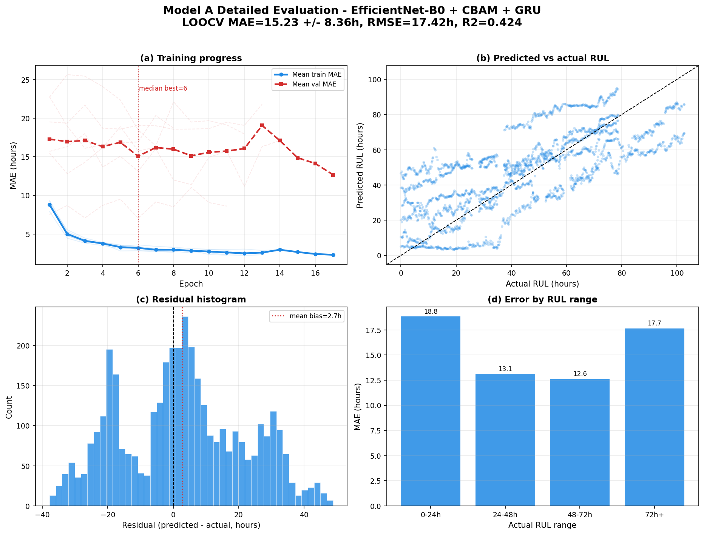

# Model A detailed evaluation report

- Architecture: **EfficientNet-B0 + CBAM + GRU**
- Backbone: EfficientNet-B0
- Temporal module: GRU
- Run root: `C:\Users\admin\Desktop\Strawberry-RUL-prediction\output\runs\strawberry\strawberry_loocv_seq8_image_only`

## Headline performance

- Fold-averaged MAE: **15.23 +/- 8.36 hours**
- Fold-averaged RMSE: **17.42 hours**
- Fold-averaged R2: **0.424**
- Fold-averaged SMAPE: **46.33%**
- Best held-out fruit: **F01** (4.65 h MAE)
- Hardest held-out fruit: **F03** (26.38 h MAE)

## Fold metrics

| test_group | val_group | best_epoch | best_val_mae | test_mae | test_rmse | test_r2 | test_smape |
| --- | --- | --- | --- | --- | --- | --- | --- |
| F01 | F02 | 8.000 | 18.580 | 4.649 | 5.718 | 0.940 | 19.283 |
| F02 | F03 | 6.000 | 7.042 | 19.020 | 21.442 | 0.496 | 47.362 |
| F03 | F04 | 7.000 | 16.409 | 26.377 | 27.136 | -0.356 | 65.632 |
| F04 | F05 | 3.000 | 16.107 | 6.012 | 8.100 | 0.879 | 29.414 |
| F05 | F06 | 2.000 | 12.825 | 16.657 | 17.959 | 0.647 | 61.477 |
| F06 | F01 | 12.000 | 11.179 | 18.693 | 24.153 | -0.063 | 54.813 |

## Prediction error distribution

- Samples: 3894 held-out sequence predictions
- Median absolute error: 14.85 hours
- 75th percentile absolute error: 23.94 hours
- 90th percentile absolute error: 31.56 hours
- Mean bias (predicted - actual): 2.72 hours

## RUL range analysis

| rul_bucket | samples | mae | median_ae | p90_ae | bias |
| --- | --- | --- | --- | --- | --- |
| 0-24h | 1146.000 | 18.830 | 17.060 | 36.299 | 15.724 |
| 24-48h | 1008.000 | 13.124 | 9.781 | 28.548 | 3.989 |
| 48-72h | 1053.000 | 12.615 | 11.286 | 25.504 | -1.204 |
| 72h+ | 687.000 | 17.652 | 17.745 | 32.394 | -14.827 |

## Detailed graph

## Metric glossary

- MAE is the average absolute prediction error in hours. Lower is better.
- RMSE penalizes large errors more strongly than MAE. Lower is better.
- R2 measures explained variance. 1 is perfect; 0 is no better than predicting the mean.
- SMAPE is percentage-style symmetric error. Lower is better.

## Recommendation

Use this model if its fold-averaged MAE/RMSE tradeoff fits deployment needs. Compare it against `model_comparison_report.md` before selecting the production checkpoint.
