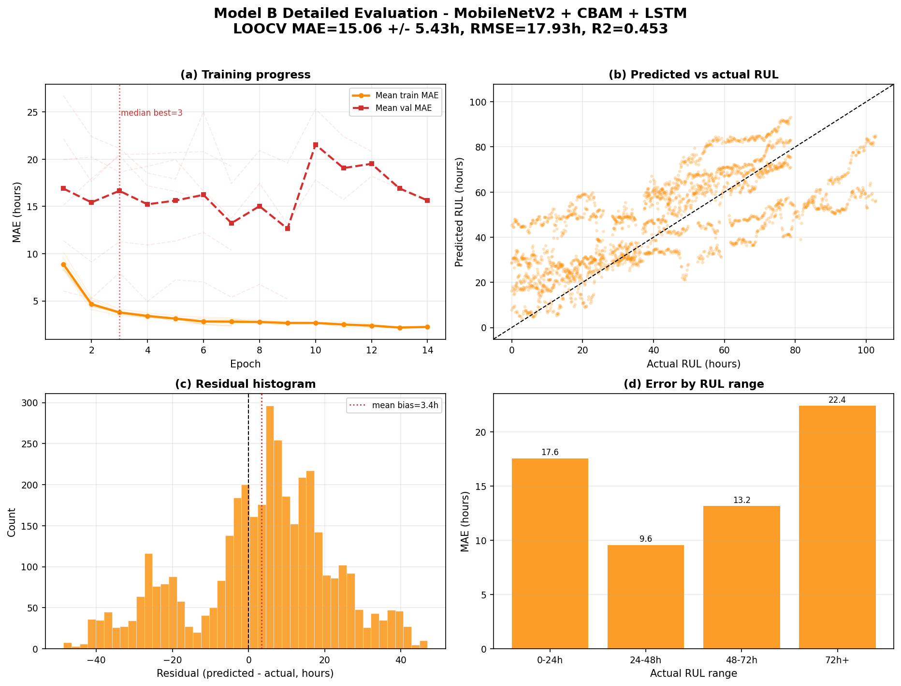

# Model B detailed evaluation report

- Architecture: **MobileNetV2 + CBAM + LSTM**
- Backbone: MobileNetV2
- Temporal module: LSTM
- Run root: `C:\Users\admin\Desktop\Strawberry-RUL-prediction\output\runs\strawberry\strawberry_loocv_seq8_image_only`

## Headline performance

- Fold-averaged MAE: **15.06 +/- 5.43 hours**
- Fold-averaged RMSE: **17.93 hours**
- Fold-averaged R2: **0.453**
- Fold-averaged SMAPE: **43.07%**
- Best held-out fruit: **F04** (6.78 h MAE)
- Hardest held-out fruit: **F03** (22.14 h MAE)

## Fold metrics

| test_group | val_group | best_epoch | best_val_mae | test_mae | test_rmse | test_r2 | test_smape |
| --- | --- | --- | --- | --- | --- | --- | --- |
| F01 | F02 | 2.000 | 17.622 | 11.187 | 13.363 | 0.671 | 39.626 |
| F02 | F03 | 2.000 | 9.126 | 17.581 | 20.235 | 0.552 | 44.714 |
| F03 | F04 | 9.000 | 13.136 | 22.141 | 23.242 | 0.005 | 59.395 |
| F04 | F05 | 1.000 | 15.122 | 6.779 | 7.680 | 0.891 | 27.917 |
| F05 | F06 | 7.000 | 17.432 | 14.842 | 20.207 | 0.553 | 32.918 |
| F06 | F01 | 4.000 | 4.946 | 17.805 | 22.868 | 0.047 | 53.872 |

## Prediction error distribution

- Samples: 3894 held-out sequence predictions
- Median absolute error: 13.12 hours
- 75th percentile absolute error: 23.17 hours
- 90th percentile absolute error: 32.06 hours
- Mean bias (predicted - actual): 3.37 hours

## RUL range analysis

| rul_bucket | samples | mae | median_ae | p90_ae | bias |
| --- | --- | --- | --- | --- | --- |
| 0-24h | 1146.000 | 17.562 | 13.763 | 37.333 | 16.609 |
| 24-48h | 1008.000 | 9.566 | 7.422 | 19.375 | 6.608 |
| 48-72h | 1053.000 | 13.160 | 11.375 | 25.351 | 0.631 |
| 72h+ | 687.000 | 22.406 | 24.125 | 39.144 | -19.289 |

## Detailed graph

## Metric glossary

- MAE is the average absolute prediction error in hours. Lower is better.
- RMSE penalizes large errors more strongly than MAE. Lower is better.
- R2 measures explained variance. 1 is perfect; 0 is no better than predicting the mean.
- SMAPE is percentage-style symmetric error. Lower is better.

## Recommendation

Use this model if its fold-averaged MAE/RMSE tradeoff fits deployment needs. Compare it against `model_comparison_report.md` before selecting the production checkpoint.
