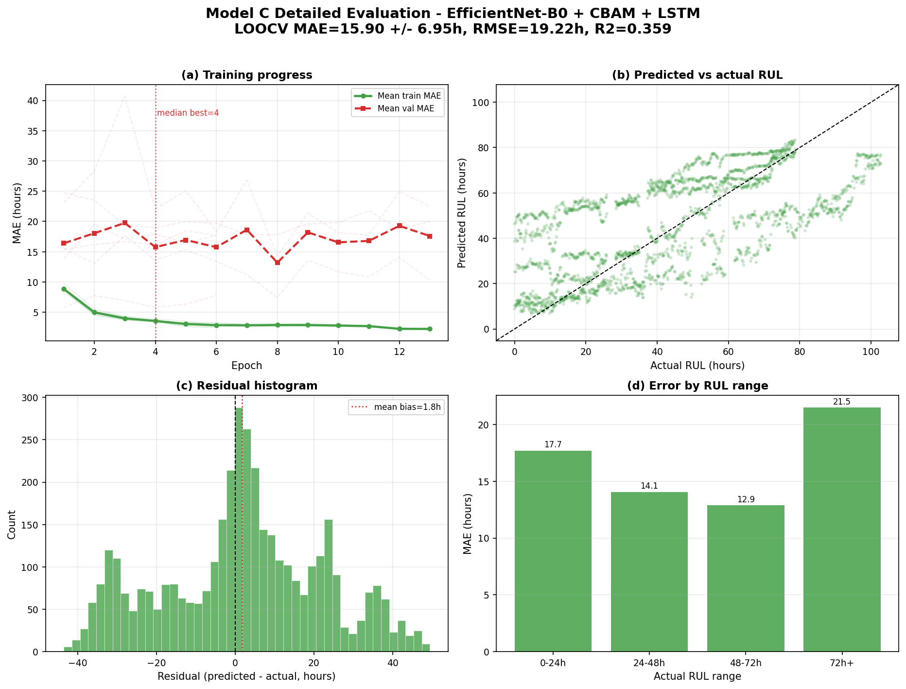

# Model C detailed evaluation report

- Architecture: **EfficientNet-B0 + CBAM + LSTM**
- Backbone: EfficientNet-B0
- Temporal module: LSTM
- Run root: `C:\Users\admin\Desktop\Strawberry-RUL-prediction\output\runs\strawberry\strawberry_loocv_seq8_image_only`

## Headline performance

- Fold-averaged MAE: **15.90 +/- 6.95 hours**
- Fold-averaged RMSE: **19.22 hours**
- Fold-averaged R2: **0.359**
- Fold-averaged SMAPE: **44.86%**
- Best held-out fruit: **F01** (7.24 h MAE)
- Hardest held-out fruit: **F03** (22.76 h MAE)

## Fold metrics

| test_group | val_group | best_epoch | best_val_mae | test_mae | test_rmse | test_r2 | test_smape |
| --- | --- | --- | --- | --- | --- | --- | --- |
| F01 | F02 | 1.000 | 13.816 | 7.240 | 9.944 | 0.818 | 24.183 |
| F02 | F03 | 1.000 | 5.771 | 21.057 | 24.084 | 0.365 | 53.177 |
| F03 | F04 | 8.000 | 14.317 | 22.759 | 25.042 | -0.155 | 61.110 |
| F04 | F05 | 1.000 | 15.414 | 7.647 | 10.784 | 0.786 | 33.844 |
| F05 | F06 | 8.000 | 17.787 | 15.822 | 19.247 | 0.594 | 38.378 |
| F06 | F01 | 8.000 | 7.446 | 20.880 | 26.203 | -0.251 | 58.461 |

## Prediction error distribution

- Samples: 3894 held-out sequence predictions
- Median absolute error: 14.00 hours
- 75th percentile absolute error: 25.40 hours
- 90th percentile absolute error: 34.75 hours
- Mean bias (predicted - actual): 1.81 hours

## RUL range analysis

| rul_bucket | samples | mae | median_ae | p90_ae | bias |
| --- | --- | --- | --- | --- | --- |
| 0-24h | 1146.000 | 17.698 | 10.588 | 38.965 | 16.600 |
| 24-48h | 1008.000 | 14.069 | 14.653 | 24.763 | 4.302 |
| 48-72h | 1053.000 | 12.878 | 10.818 | 30.278 | -2.433 |
| 72h+ | 687.000 | 21.492 | 26.188 | 36.211 | -20.042 |

## Detailed graph

## Metric glossary

- MAE is the average absolute prediction error in hours. Lower is better.
- RMSE penalizes large errors more strongly than MAE. Lower is better.
- R2 measures explained variance. 1 is perfect; 0 is no better than predicting the mean.
- SMAPE is percentage-style symmetric error. Lower is better.

## Recommendation

Use this model if its fold-averaged MAE/RMSE tradeoff fits deployment needs. Compare it against `model_comparison_report.md` before selecting the production checkpoint.
