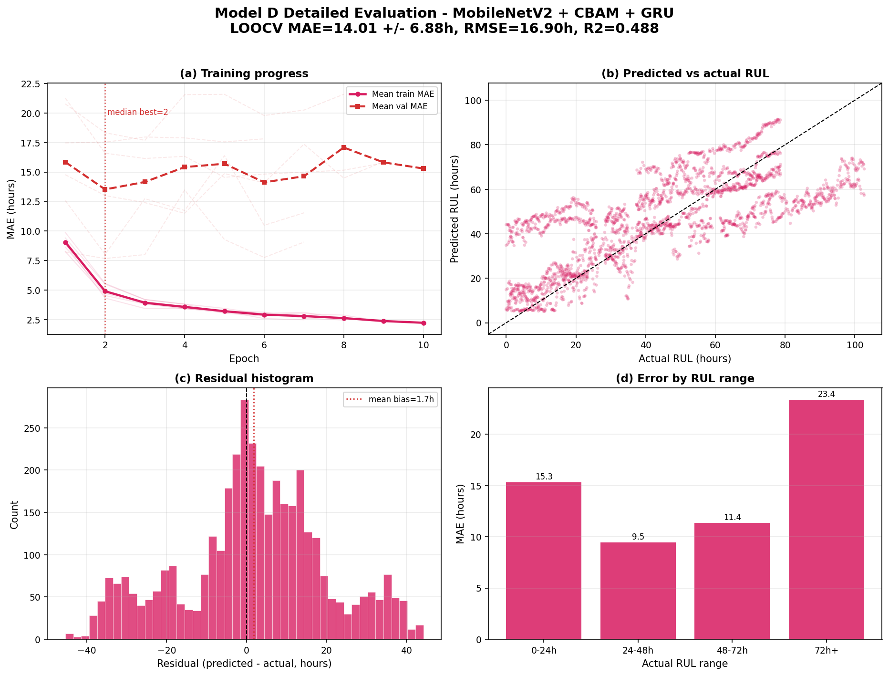

# Model D detailed evaluation report

- Architecture: **MobileNetV2 + CBAM + GRU**
- Backbone: MobileNetV2
- Temporal module: GRU
- Run root: `C:\Users\admin\Desktop\Strawberry-RUL-prediction\output\runs\strawberry\strawberry_loocv_seq8_image_only`

## Headline performance

- Fold-averaged MAE: **14.01 +/- 6.88 hours**
- Fold-averaged RMSE: **16.90 hours**
- Fold-averaged R2: **0.488**
- Fold-averaged SMAPE: **39.65%**
- Best held-out fruit: **F04** (5.75 h MAE)
- Hardest held-out fruit: **F03** (23.34 h MAE)

## Fold metrics

| test_group | val_group | best_epoch | best_val_mae | test_mae | test_rmse | test_r2 | test_smape |
| --- | --- | --- | --- | --- | --- | --- | --- |
| F01 | F02 | 5.000 | 14.551 | 6.200 | 8.332 | 0.872 | 23.008 |
| F02 | F03 | 2.000 | 7.671 | 16.789 | 20.213 | 0.553 | 39.334 |
| F03 | F04 | 4.000 | 11.502 | 23.342 | 24.832 | -0.136 | 61.553 |
| F04 | F05 | 1.000 | 17.466 | 5.749 | 7.064 | 0.908 | 27.061 |
| F05 | F06 | 3.000 | 17.686 | 14.490 | 19.184 | 0.597 | 33.780 |
| F06 | F01 | 2.000 | 8.025 | 17.488 | 21.784 | 0.135 | 53.163 |

## Prediction error distribution

- Samples: 3894 held-out sequence predictions
- Median absolute error: 11.00 hours
- 75th percentile absolute error: 21.72 hours
- 90th percentile absolute error: 33.38 hours
- Mean bias (predicted - actual): 1.74 hours

## RUL range analysis

| rul_bucket | samples | mae | median_ae | p90_ae | bias |
| --- | --- | --- | --- | --- | --- |
| 0-24h | 1146.000 | 15.310 | 8.987 | 36.440 | 14.111 |
| 24-48h | 1008.000 | 9.460 | 8.206 | 19.368 | 6.967 |
| 48-72h | 1053.000 | 11.374 | 10.755 | 21.625 | -1.826 |
| 72h+ | 687.000 | 23.352 | 27.620 | 36.245 | -21.124 |

## Detailed graph

## Metric glossary

- MAE is the average absolute prediction error in hours. Lower is better.
- RMSE penalizes large errors more strongly than MAE. Lower is better.
- R2 measures explained variance. 1 is perfect; 0 is no better than predicting the mean.
- SMAPE is percentage-style symmetric error. Lower is better.

## Recommendation

Use this model if its fold-averaged MAE/RMSE tradeoff fits deployment needs. Compare it against `model_comparison_report.md` before selecting the production checkpoint.
