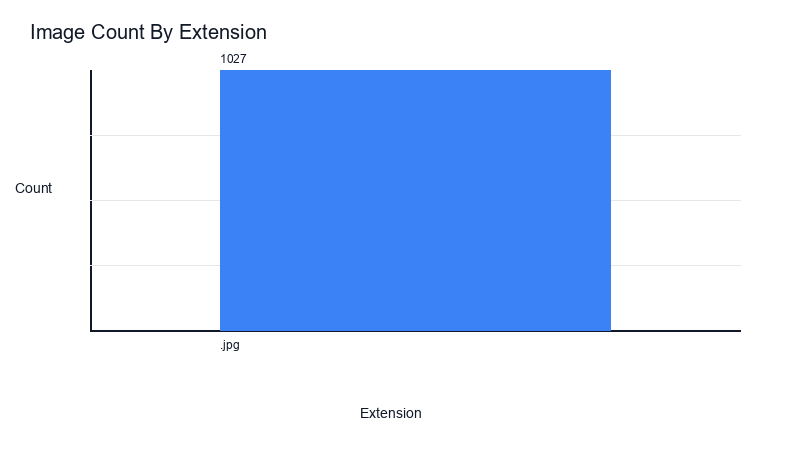
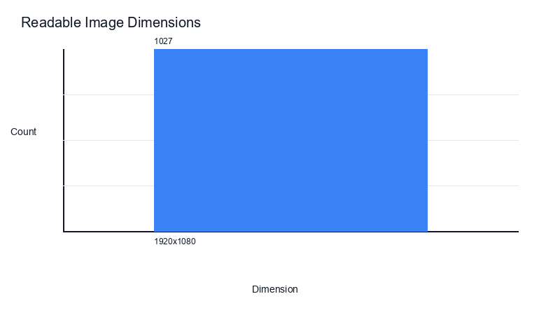
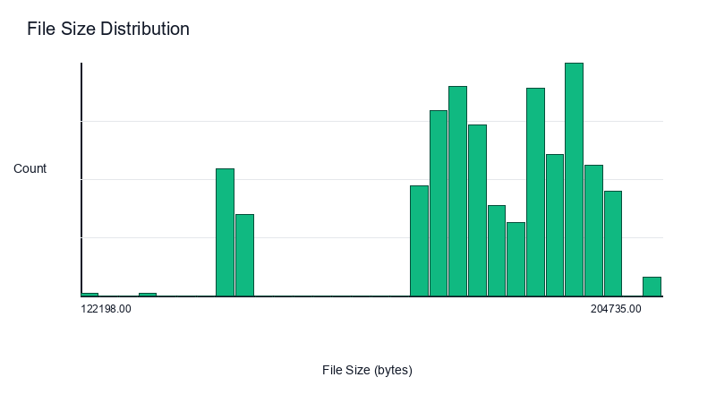
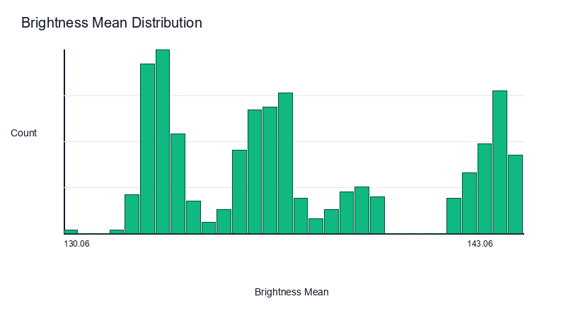
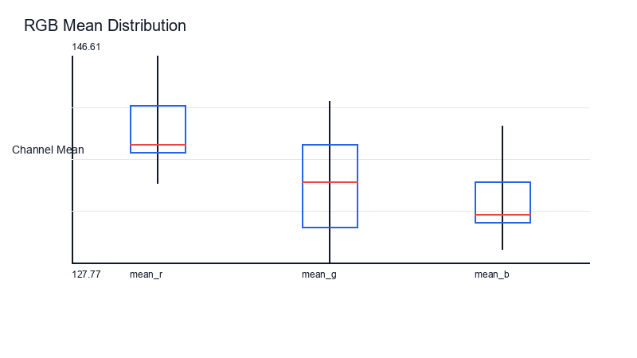

# Stage 1.5 Image Inventory Summary

This report summarizes technical image properties from the Stage 1.5 master inventory CSV.

## Run Overview

- Inventory rows: 1027
- Readable images: 1027
- Unreadable images: 0
- Naming rule matches: 1027
- Naming rule failures: 0

## File Types

| Extension | Count |
| --- | ---: |
| .jpg | 1027 |

## Dimensions

| Dimension | Count |
| --- | ---: |
| 1920x1080 | 1027 |

## Color Modes And Channels

| Color Mode | Count |
| --- | ---: |
| RGB | 1027 |

| Channels | Count |
| --- | ---: |
| 3 | 1027 |

## Numeric Summaries

| Column | Count | Min | Max | Mean |
| --- | ---: | ---: | ---: | ---: |
| file_size_bytes | 1027 | 122198.0000 | 204735.0000 | 179617.3768 |
| mean_r | 1027 | 134.9481 | 146.6052 | 140.2604 |
| mean_g | 1027 | 127.7684 | 142.4133 | 135.3634 |
| mean_b | 1027 | 128.9690 | 140.1997 | 133.6375 |
| std_r | 1027 | 54.0796 | 58.6715 | 56.2669 |
| std_g | 1027 | 53.9537 | 61.5824 | 57.6334 |
| std_b | 1027 | 59.3543 | 65.7544 | 62.8680 |
| min_r | 1027 | 0.0000 | 13.0000 | 2.7741 |
| min_g | 1027 | 0.0000 | 0.0000 | 0.0000 |
| min_b | 1027 | 0.0000 | 0.0000 | 0.0000 |
| max_r | 1027 | 234.0000 | 255.0000 | 244.1081 |
| max_g | 1027 | 225.0000 | 248.0000 | 232.5346 |
| max_b | 1027 | 228.0000 | 255.0000 | 236.5735 |
| brightness_mean | 1027 | 130.0637 | 143.0585 | 136.6308 |
| brightness_std | 1027 | 54.9840 | 60.6849 | 57.6210 |

## Charts

### Extension Counts

### Dimension Counts

### File Size Distribution

### Brightness Mean Distribution

### Rgb Mean Boxplot

## Unreadable Files

No unreadable files found.

## Recommended Review Actions

- Confirm whether the sample inventory columns are sufficient before full-dataset execution.
- Review any unreadable files or naming-rule failures before treating the inventory as stable.
- Use the full config only after the sample pipeline outputs are accepted.
