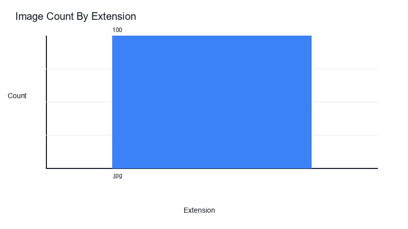
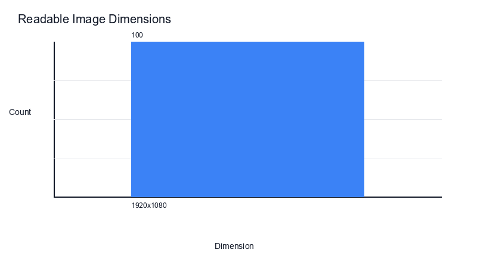
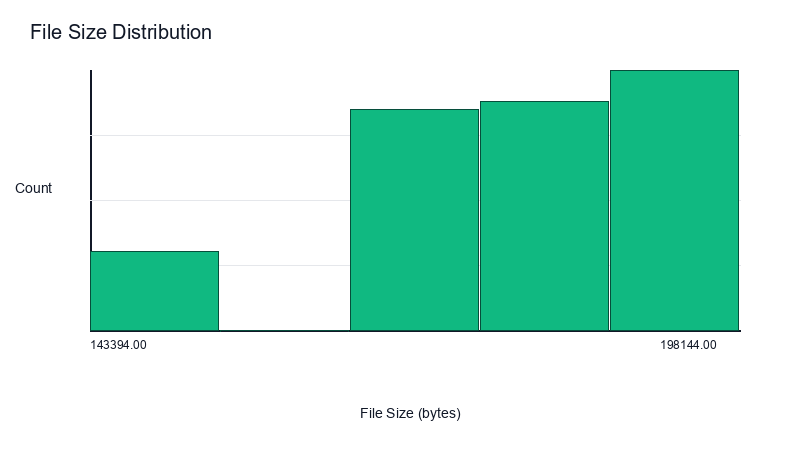
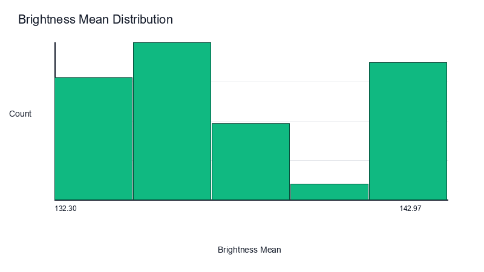
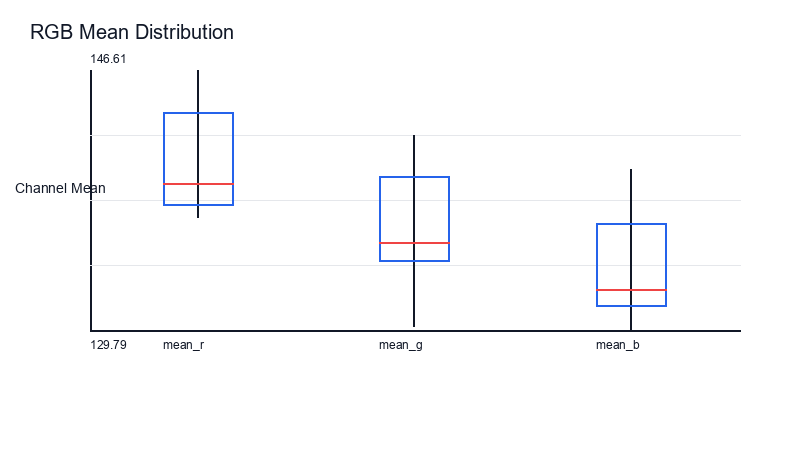

# Stage 1.5 Image Inventory Summary

This report summarizes technical image properties from the Stage 1.5 master inventory CSV.

## Run Overview

- Inventory rows: 100
- Readable images: 100
- Unreadable images: 0
- Naming rule matches: 100
- Naming rule failures: 0

## File Types

| Extension | Count |
| --- | ---: |
| .jpg | 100 |

## Dimensions

| Dimension | Count |
| --- | ---: |
| 1920x1080 | 100 |

## Color Modes And Channels

| Color Mode | Count |
| --- | ---: |
| RGB | 100 |

| Channels | Count |
| --- | ---: |
| 3 | 100 |

## Numeric Summaries

| Column | Count | Min | Max | Mean |
| --- | ---: | ---: | ---: | ---: |
| file_size_bytes | 100 | 143394.0000 | 198144.0000 | 179094.3100 |
| mean_r | 100 | 137.0690 | 146.6052 | 140.6613 |
| mean_g | 100 | 130.0189 | 142.3413 | 136.0036 |
| mean_b | 100 | 129.7883 | 140.1670 | 133.9867 |
| std_r | 100 | 54.1862 | 58.6517 | 56.3235 |
| std_g | 100 | 54.4738 | 61.5824 | 57.3799 |
| std_b | 100 | 59.8387 | 65.7314 | 63.0836 |
| min_r | 100 | 0.0000 | 12.0000 | 2.9500 |
| min_g | 100 | 0.0000 | 0.0000 | 0.0000 |
| min_b | 100 | 0.0000 | 0.0000 | 0.0000 |
| max_r | 100 | 236.0000 | 255.0000 | 244.7300 |
| max_g | 100 | 225.0000 | 244.0000 | 233.0800 |
| max_b | 100 | 228.0000 | 254.0000 | 237.2400 |
| brightness_mean | 100 | 132.2966 | 142.9711 | 137.1663 |
| brightness_std | 100 | 55.4354 | 60.6721 | 57.5135 |

## Charts

### Extension Counts

### Dimension Counts

### File Size Distribution

### Brightness Mean Distribution

### Rgb Mean Boxplot

## Unreadable Files

No unreadable files found.

## Recommended Review Actions

- Confirm whether the sample inventory columns are sufficient before full-dataset execution.
- Review any unreadable files or naming-rule failures before treating the inventory as stable.
- Use the full config only after the sample pipeline outputs are accepted.
